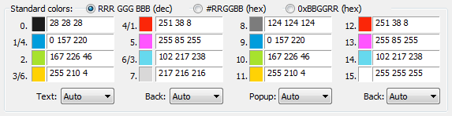
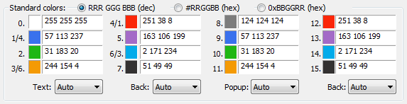

# ConEmu

## Settings

 - Customize tab title
   - Main → Tab bar → Console: `%s`
 - Hide custom words from Tabs
   - Main → Tab bar → Skip words from title: `Administrator:|MINGW64:/`
 - Disable Win7+ taskbar buttons
   - Main → Task bar → Taskbar buttons → Active console only
 - Startup shell
   - Startup → Specified named task: `{Bash::Git bash}`
 - Don't fade colors when inactive:
   - Features → Colors → [ ] Fade when inactive
 - Explorer Integration
   - Integration → Register `{Git bash}`
 - Don't confirm pasting long lines
   - Keys & Macro → Paste → [ ] Multi-line paste / Long text paste
 - Add multiple lines on Ctrl + V
   - Keys & Macro → Paste → Switch Paste mode #1 / #2

## Features

 - Open ComEmu on a specific path
    - ```ConEmu.exe -Dir <path>```

## Tasks

```bash
"C:\Program Files\Git\git-cmd.exe" --no-cd --command=usr/bin/bash.exe -l -i  -new_console:d:D:\projects\dev\ -c "state-all; pause" -new_console:t:"state-all"
```

## Color Themes

### Monokai Theme



### Light Theme



