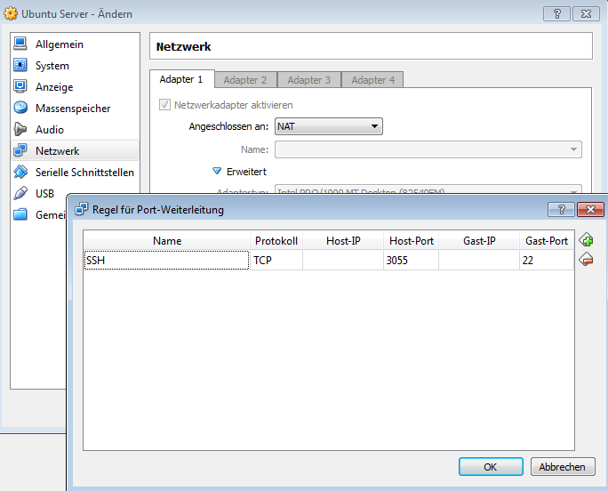

# Virtual Box

## Headless Mode

- Hold `Shift` when starting, or
- `VBoxManage.exe startvm "Ubuntu Server" --type headless`

## SSH Login

- Server:  `sudo apt-get install openssh-server`
- Client: `ssh -p 3022 localhost`

