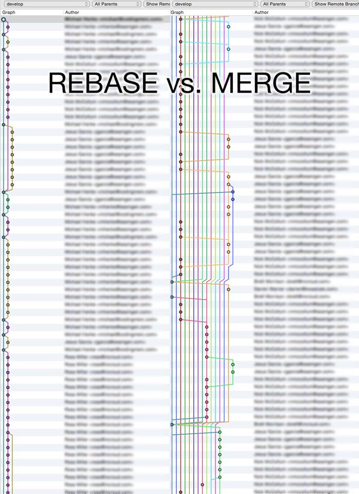

# Git

| Command                                      | Description                                     |
| -------------------------------------------- | ----------------------------------------------- |
| `git branch -d <local-branch>`               | Delete a local branch                           |
| `git push origin :<remote-branch>`           | Delete a remote branch                          |
| `git diff --cached`                          | Show staged changes                             |
| `git reset`                                  | Unstage all staged changes                      |
| `git checkout .`                             | Revert all modified changes                     |
| `git clean -f`                               | Remove untracked files from the working tree    |
| `git reset HEAD~`                            | Undo last commit, leave changes unstaged        |
| `git commit --amend -m "<msg>"`              | Change last commit message                      |
| `git commit --allow-empty --amend --no-edit` | Recommit last commit (hook test)                |

## Git clients

 - [SourceTree](https://www.sourcetreeapp.com/)
 - [TortoiseGit](https://tortoisegit.org/)
 - [GitKraken](https://www.gitkraken.com/)
 - [Git Tower](https://www.git-tower.com/windows/)

## Set default editor

```ini
# Vim (default)
editor = "vim"

# Notepad++
# Either add the exe to PATH or provide the full path
editor = "'C:/Program Files (x86)/Notepad++/notepad++.exe' -multiInst -notabbar -nosession -noPlugin"
editor = "notepad++ -multiInst -notabbar -nosession -noPlugin"

# VSCode
editor = "code --wait"

# Atom
editor = "atom --wait"

# Sublime Text 3
editor = "subl -w"

# TextMate
# If "mate" is not available:
# ln -s /Applications/TextMate.app/Contents/Resources/mate /usr/local/bin/mate
editor = "mate -w""

```

## Rebase vs Merge



[Source](https://twitter.com/michaelhenke/status/585142133167751169)

## Do not fetch any tags

```
[remote "origin"]
  tagopt = --no-tags
```

- Delete all existing local tags:

```
git tag | xargs git tag -d
```

## Pull a branch without checkout

- https://stackoverflow.com/a/17722977/1116549

```
git fetch origin main:main
```

## Conditional configuration

```
[includeIf "gitdir:~/personal/"]
  path = .gitconfig-personal
```

## Ignore commits

- [--ignore-revs-file](https://git-scm.com/docs/git-blame#Documentation/git-blame.txt---ignore-revs-fileltfilegt)
- [How to exclude commits from git blame](https://www.stefanjudis.com/today-i-learned/how-to-exclude-commits-from-git-blame/)

```shell
git config blame.ignoreRevsFile .git-blame-ignore-revs
```
