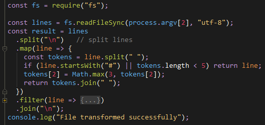

# IntelliJ IDEA

## Plugins

- [File Watchers](https://plugins.jetbrains.com/plugin/7177-file-watchers)
  - Executes task on file modifications
- [Ignore](https://plugins.jetbrains.com/plugin/7495--ignore)
  - Support for ignore files
- [Presentation Assistant](https://plugins.jetbrains.com/plugin/7345-presentation-assistant)
  - Display shortcuts for invoked actions
- [Shifter](https://plugins.jetbrains.com/plugin/6149-shifter)
  - Shifts many types of values up and down with a keyboard shortcut
- [String Manipulation](https://plugins.jetbrains.com/plugin/2162-string-manipulation)
  - Provides actions for text manipulation

## Color Themes

### DK Monokai

### DK Tomorrow Night

## Settings

Show current memory usage in the status bar
  - ☑ Appearance & Behavior → Appearance → Show memory indicator

Adjust for widescreen
  - ☑ Appearance & Behavior → Appearance → Widescreen tool window layout

Reopen last project on startup
  - ☑ Appearance & Behavior → System Settings → Startup/Shutdown → Reopen last project on startup

Zoom with mouse wheel
  - ☑ Editor → General → Change font size (zoom) with Ctrl+Mouse Wheel

Wrap long lines
  - ☑ Editor → General → Use soft wraps in editor
  - ☑ Editor → General → Use soft wraps in console
  - Editor → General → Use custom soft wraps indent: `1`

Trim trailing whitespace
  - Editor → General → Strip trailing spaces on save: All

Add line feed at file end
  - ☑ Editor → General → Ensure line feed at file end on save

Add indent according to code styles by pressing Enter
  - ☑ Editor → General → Smart Keys → Enter → Smart indent

Whitespace-only modifications
  - ☑ Editor → General → Different color for lines with whitespace-only modifications

Show line numbers
  - ☑ Editor → General → Appearance → Show line numbers

Add unambiguous imports on the fly
  - ☑ Editor → General → Auto Import → Add unambiguous imports on the fly

Hide file extensions and close icons on tabs
  - ☑ Editor → General → Editor Tabs → Hide file extension in editor tabs
  - ☐ Editor → General → Editor Tabs → Show "close" button on editor tabs

Open recent tab on closing another tab
  - ☑ Editor → General → Editor Tabs → When closing active editor: Activate most recently opened tab

Exclude some packages and classes from auto import/completion
  - Editor → General → Auto Import → Exclude from Import and Completion

Don't use RTF for copy
  - ☐ Editor → General → Copy as rich text by default

Disable Emmet for CSS
  - ☐ Editor → Emmet → CSS → Enable CSS Emmet

Sort debugger fields alphabetically
  - ☑ Build, Execution, Deployment → Debugger → Data Views → Sort alphabetically

Make project automatically
  - ☑ Build, Execution, Deployment → Compiler → Make project automatically

Turn off [selected tab underline](https://youtrack.jetbrains.com/issue/IDEA-131683#comment=27-2112280)
  - Registry → `ide.new.editor.tabs.selection`

Speed-up merging
  - ☑ Tools → Diff & Merge → Automatically apply non-conflicting changes

Use absolute paths for JavaScript imports
  - ☑ Editor → Color Style → JavaScript → Imports → Use paths relative to the project, resource or sources roots

Set TODO format
  - Editor → TODO → ☑ Case Sensitive, `\bTODO\b:?`

## VCS Ignore Files

If you decide to share IDE project files with other developers, share:
 - All the files under `.idea` directory in the project root except `workspace.xml` and `tasks.xml` which store user specific settings
 - All the .iml module files that can be located in different module directories (applies to IntelliJ IDEA)

[Source](https://intellij-support.jetbrains.com/hc/en-us/articles/206544839)
