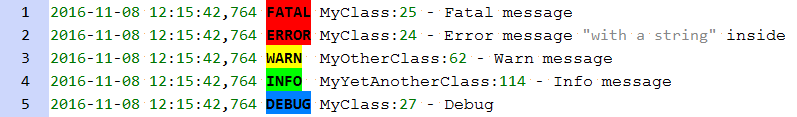
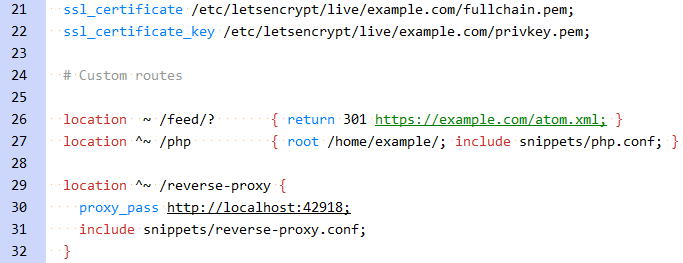
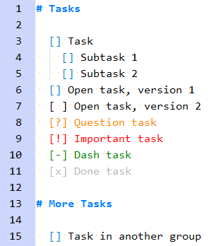
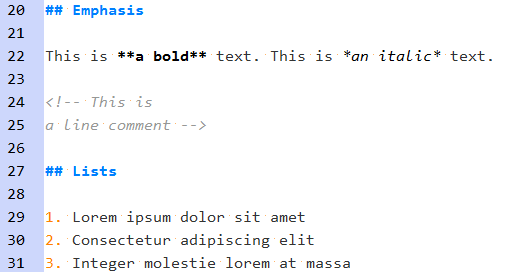
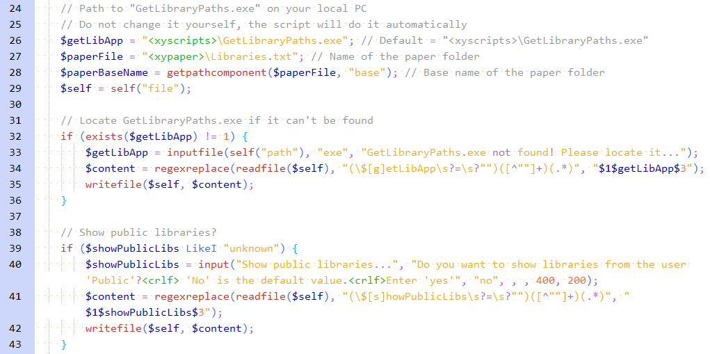

# Notepad++

## Settings

- Use UTF-8 encoding per default
  - New Document → Encoding → `UTF-8`
- Update files automatically:
  - ☑ Preferences → Misc. → Update silently

## Syntax Highlighting

- [How to install user defined language files](http://docs.notepad-plus-plus.org/index.php/User_Defined_Language_Files#How_to_install_user_defined_language_files)

### Logfile

See my [blog post](https://darekkay.com/blog/turn-notepad-into-a-log-file-analyzer/) for more information.

### Nginx

Based on the work of [dslatten](https://github.com/dslatten/nginx_npp).

### Todo

### Markdown

Based on [markdown plus plus](https://github.com/Edditoria/markdown-plus-plus).

### XYplorer

Based on the work of [Enternal](https://www.xyplorer.com/xyfc/viewtopic.php?f=7&t=9810).

