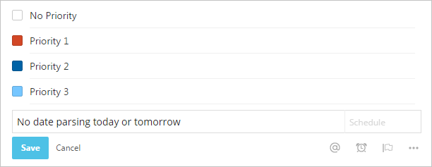

## Userscripts

Scripts which enhance the look and behavior of websites.

##### Installation

When using [**Tampermonkey**](https://chrome.google.com/webstore/detail/tampermonkey/dhdgffkkebhmkfjojejmpbldmpobfkfo) (Chrome) or [**Greasemonkey**](https://addons.mozilla.org/de/firefox/addon/greasemonkey/) (Firefox), just click "Install". To install a script in **Chrome** without Tampermonkey, go to `Settings > Extensions` and drop the `*.user.js` file into that browser tab.

### Todoist Enhancements

Brings back square checkboxes, former priority colors and turns off the date parser.

* [**Install**](https://github.com/darekkay/config-files/raw/master/userscripts/todoist-enhancements.user.js)

### Steam Discovery Queue Auto Click

Steam rewards 3 Summer/Winter Sale Trading Cards per day for browsing the [Discovery Queue](http://store.steampowered.com/explore/). This script automates the process.

* [**Install**](https://github.com/darekkay/config-files/raw/master/userscripts/steam-discovery-queue.user.js)

### Better styles

My custom website CSS changes.

* [**Install**](https://github.com/darekkay/config-files/raw/master/userscripts/better-styles.user.js)
